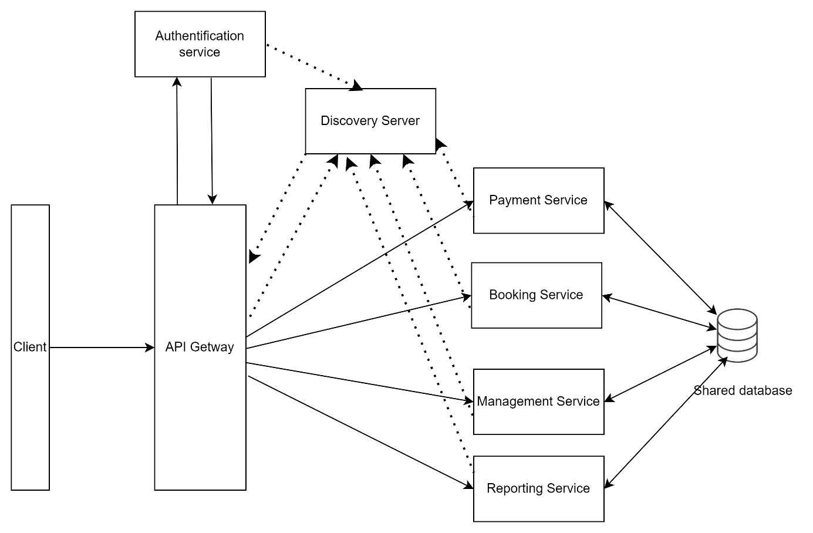

## Link frontend repository using Next.js [Click here](https://github.com/dinhhongkong/bus-ticket-booking-next-js)

## Kiến trúc hệ thống Microservices

•	**Client:** Là giao diện người dùng hoặc ứng dụng khách kết nối với hệ thống. Người dùng sẽ tương tác với ứng dụng thông qua Client để thực hiện các thao tác như đặt vé, thanh toán, và quản lý thông tin.	

•	__API Gateway:__ API Gateway đóng vai trò làm cầu nối giữa Client và các dịch vụ backend. Nó chịu trách nhiệm tiếp nhận tất cả các yêu cầu từ Client, định tuyến các yêu cầu đó tới các dịch vụ thích hợp và trả kết quả lại cho Client. API Gateway cũng có thể thực hiện các nhiệm vụ như xác thực, cân bằng tải, và kiểm tra lỗi.	

•	__Authentication Service:__ Dịch vụ xác thực người dùng. Khi người dùng đăng nhập, Authentication Service sẽ kiểm tra thông tin đăng nhập và xác thực quyền truy cập của người dùng. Sau khi xác thực, nó sẽ cấp phát token để người dùng có thể sử dụng cho các yêu cầu tiếp theo.

•	__Discovery Server:__ Discovery Server (còn gọi là Eureka Server trong Spring Cloud) giúp quản lý thông tin về các dịch vụ microservice trong hệ thống. Các dịch vụ sẽ tự động đăng ký vào Discovery Server và Client hoặc các dịch vụ khác có thể tìm và gọi dịch vụ thông qua Discovery Server.

•	__Payment Service:__ Dịch vụ thanh toán chịu trách nhiệm xử lý các giao dịch thanh toán cho việc đặt vé. Nó quản lý các phương thức thanh toán, xác nhận giao dịch và cập nhật trạng thái thanh toán.

•	__Booking Service:__ Dịch vụ đặt vé chịu trách nhiệm quản lý quy trình đặt vé, bao gồm tìm kiếm chuyến đi, chọn ghế, và lưu trữ thông tin đặt vé. Booking Service tương tác với các dịch vụ khác như Payment Service để hoàn thành quá trình đặt vé.

•	__Management Service:__ Dịch vụ quản lý chịu trách nhiệm quản lý các thông tin liên quan đến hoạt động của nhà xe như thông tin về xe, tài xế, lịch trình, và các trạm dừng. Nó giúp nhà xe theo dõi và điều phối các hoạt động hàng ngày.

•	__Reporting Service:__ Dịch vụ báo cáo chịu trách nhiệm tạo ra các báo cáo và thống kê từ dữ liệu vận hành. Reporting Service giúp ban lãnh đạo doanh nghiệp phân tích hoạt động kinh doanh và đưa ra quyết định dựa trên dữ liệu.

•	__Database:__ Tất cả các dịch vụ microservice trong hệ thống đều tương tác với cơ sở dữ liệu để lưu trữ và truy xuất dữ liệu cần thiết. Mỗi dịch vụ dùng chung database (gọi là shared database).

